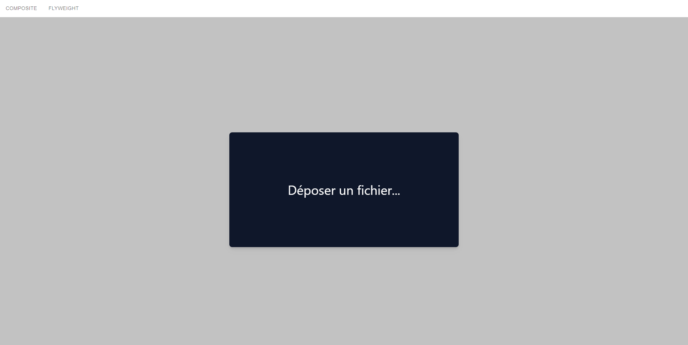
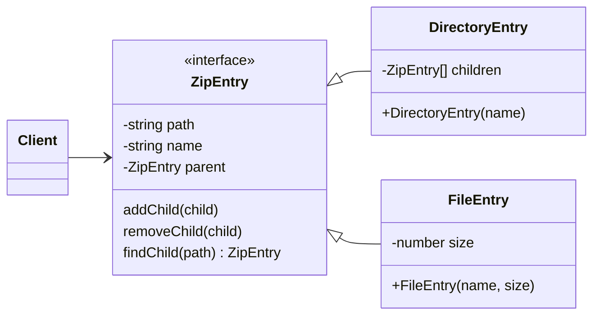

# Design Pattern Composite & Flyweight

Ce projet Github présente les designs patterns "Composite" et "Flyweight" pour le cours de Modélisation et de conception orientée objet du Master en Architecture des Systèmes Informatiques à l'HEPL à Liège, en Belgique.

## Composite

Le projet composite est représenté sous un projet très simple de lecture de fichier ZIP et de son contenu. Le principe est de glisser et déposer un fichier ZIP dans le rectangle libellé par "Déposer un fichier"


Le fichier va être chargé par le code en TypeScript et va afficher une arborescence de dossiers et fichiers


### Fonctionnement du code

Le code propose une interface et deux implémentation de cette dernière



Les fichiers ZIP sont lus avec la librairie [jszip](https://www.npmjs.com/package/jszip).

La partie de la structure du fichier JSZip qui nous intéresse est la suivante:
```ts
interface SimplifiedZipFile {
    dir: boolean
    name: string
    _data: { uncompressedSize: number } // spécifique aux fichiers
}
```

La classe `JSZip` nous permets d'accéder à une méthode qui parcours tous les fichiers dans le zip:

```ts
interface SimplifiedJSZip {
    forEach(callback: (file: SimplifiedZipFile, path: string) => void): void
}
```

Avec ces trois variables, nous pouvons créer l'arboresence des fichiers en se basant sur le diagramme de classe un peu plus haut:

```ts
const zip: JSZip
let rootEntry: ZipEntry
let zipEntry: ZipEntry

// Pour chaque fichiers
zip.forEach((file, path) => {
    if (file.dir === true) { // Si c'est un dossier
        zipEntry = new DirectoryEntry(path);
    }
    else { // Si c'est un fichier
        zipEntry = new FileEntry(path, file._data.uncompressedSize);
    }

    let parentPath = getParentFrom(path); // récupère le chemin du parent
    let parent = rootEntry.findChild(parentPath); // retourne l'instance du parent dans la hiérarchie

    parent.addChild(zipEntry);
});
```

Cet algorithme de "parsing" de l'API `JSZip` au design pattern Composite créé pour l'exmeple de ce projet se trouve dans [ZipParser.ts](/src/app/utils/ZipParser.ts).

### Récupération de la taille d'un dossier

Un des exemples du principe Composite illustré dans cet exemple est le calcul de la taille total d'un dossier. Un dossier, n'ayant pas de taille à proprement parlé, va demander la taille des enfants de ce dernier afin de calculer sa taille.

```ts
class DirectoryEntry {
    // Retourne la somme de la taille de ses enfants
    getSize(): number {
        return this._children
            .map(child => child.getSize())
            .reduce((a, b) => a + b);
    }
}

class FileEntry {
    constructor (private _name: string, private _size: number) {}

    // Retourne sa taille non compressée
    getSize(): number {
        return this._size;
    }
}
```

## Lancement du projet:
```sh
$ yarn
ou
$ npm install
```
Installe les dépendences requises pour lancer le projet

```sh
$ yarn start
ou
$ npm start
```
Démarre l'application en local sous [http://localhost:3000](http://localhost:3000)


